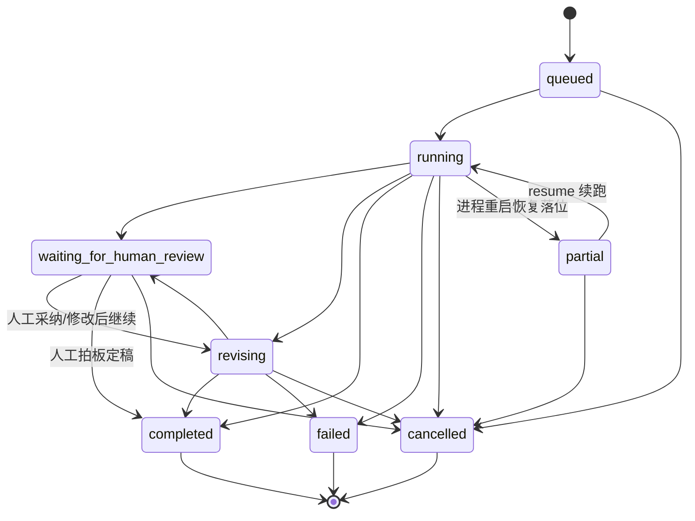

# zylo 运行时架构说明（M0 契约基线）

> 一页说明当前形态与目标形态的边界。详细规划见 PLAN.md，本文只回答
> 「系统由什么组成、数据怎么流、状态怎么迁移」。

## 分层

```text
CLI（zylo write / check / config）        ← 调试与故障排查入口，长期保留
Web 工作台（React，M3）                    ← 演示主入口
        │
FastAPI（api/，M1）                        ← REST + SSE，可回放
        │
JobRunner（asyncio，M1）                   ← 单机并发上限、取消
        │
WritingOrchestrator（src/orchestrator.py） ← 现有核心，CLI 与 API 共用
  Researcher → Planner → Writer ⇄ Reviewer（最多 max_revisions 轮）
        │
RunStore（SQLite，M2）/ Persistent Chroma  ← 持久化与恢复
```

原则：CLI 与 API 共用同一个 Orchestrator；Agent 之间只通过 `WritingState`
传递数据（见 AGENTS.md 架构不变量）。

## 运行状态机

状态定义与迁移校验的**代码事实来源**是 `src/runs.py` 的 `_ALLOWED_TRANSITIONS`。



要点：

- `running → revising` 允许无人介入的自动修订（当前 Orchestrator 行为）；
  `waiting_for_human_review` 是 M3 人在回路引入的停点。
- `partial` 只由服务恢复逻辑从遗留 `running` 落位，只能被 resume 或取消。
- 时间戳是迁移副作用：进入 `running` 落 `started_at`（resume 不覆盖），
  进入终态落 `finished_at`。

## 事件模型

事实来源是 SQLite `run_events` 表（M2）；进程内 TraceBus 只做实时分发；
SSE 投递与 JSONL 导出共用 `RunEvent.to_json()`。事件结构：

| 字段 | 说明 |
|---|---|
| `sequence` | run 内递增序号，同时是 SSE 的 `id`，支持 `Last-Event-ID` 回放 |
| `schema_version` | 事件结构版本，不兼容变更时递增 |
| `kind` | 五层 span：`run` / `stage` / `agent` / `llm` / `tool` |
| `name` | 具体名称（如 `researcher`、`web_search`） |
| `status` | `started` / `completed` / `failed` |
| `span_id` / `parent_id` | span 层级；run 层事件 `parent_id` 为空 |
| `payload` | 脱敏后的属性（Token 用量、耗时、错误摘要） |

脱敏规则（`src/events.py` 的 `sanitize_payload`，所有事件出口共用）：
密钥类键（`api_key`、`authorization` 等，精确匹配）替换为 `[REDACTED]`；
内容类键（`prompt`、`messages`、`content` 等）只保留长度线索；
任意超长字符串截断到 500 字符。统计数据（如 `token_usage`）不受影响。

## 核心数据模型（M0 已定，代码见 src/runs.py）

| 模型 | 对应持久化表（M2） | 说明 |
|---|---|---|
| `Run` | `runs` | 运行实体，含状态机迁移方法 |
| `Revision` | `revision_snapshots` | 一轮稿件快照 + 审稿结果 |
| `Artifact` | `artifacts` | 导出产物（article / trace），路径必须相对 |
| `Source` | `run_sources` | 抓取来源，状态含摘要兜底 DEGRADED |
| `Critique` | （review JSON 内） | 稳定 ID + 作用域 + 建议的审稿意见 |
| `ReviewDecision` | （M3） | 人工对单条意见的 accept/reject/edit/approve_final |
